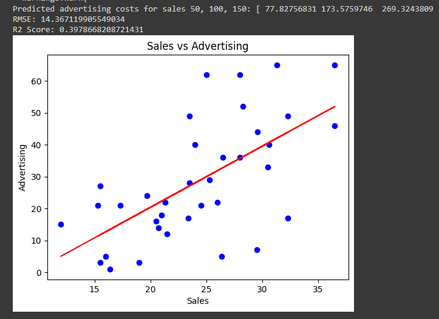

# Prediksi Biaya Iklan Berdasarkan Penjualan

Repositori ini berisi model regresi sederhana untuk memprediksi biaya iklan berdasarkan data penjualan.

## Dataset

Dataset `sales.txt` berisi dua kolom: Penjualan (Sales) dan Iklan (Advertising) dalam juta $.

## Cara Menjalankan

1. Pastikan Python sudah terpasang.
2. Instal paket yang diperlukan:
   ```bash
   pip install pandas numpy matplotlib scikit-learn

## Hasil Prediksi


